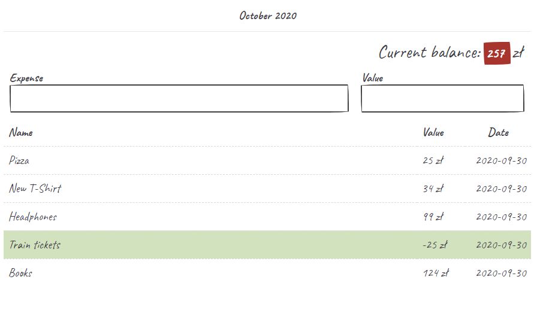
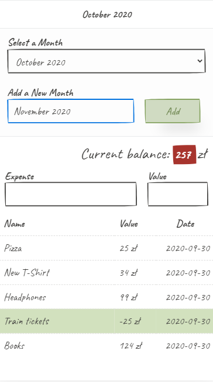

# Billing v3

> Simple Flask server app for tracking monthly expenses

[]()

[]()

## Features

- runs on **Python's Flask** server
- stores expenses in local **sqlite** database
- abillity to add new months
- simple JS form validation
- uses **PaperCSS** library
- mobile first

## Dependencies
- Python 3
- Flask
- Sql Alchemy

## How to

### Activate virtualenv (Windows, local)
```
env\Scripts\activate.bat
```

### Create Database
```
$ sudo python3
>>> from app import db
>>> db.create_all()
>>> exit()
```
### Run a Webserver
```
sudo python3 app.py
```
To work as a webserver the app has to be served on port `80`.

Define host and port number in `env.py` file:
```
HOST = "0.0.0.0"
PORT = 80
```
